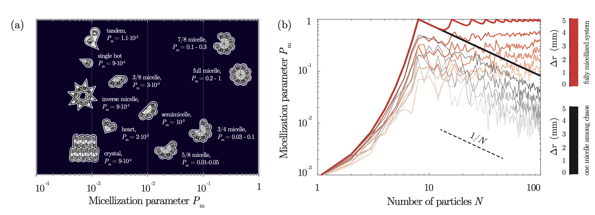

# Анализ выживаемости эмерджентных структур в роевой робототехнике 
Трек: Research

Участники: Лисичкин Александр

Руководитель: Захаров Андрей

Описание: Осмысление и развитие исследования мицеллизации на базе экспериментов https://arxiv.org/abs/2305.16659

## Чекпоинты
1. Дополнительный обзор связанных публикаций - доуточнение плана исследования. Получение доступа к данным экспериментов. Разработка модуля загрузки и предобработки данных. EDA и первичный анализ по мотивам публикаций
2. Анализ выживаемости с использованием ML
3. Эксперименты по адаптации подходов ALIGNN и ChemProp, как минимум для обогащения признакового пространства, как максимум уход от ML в GNN
4. Предсказание распределения роботов по арене (с переиспользованием результатов 2-3)
